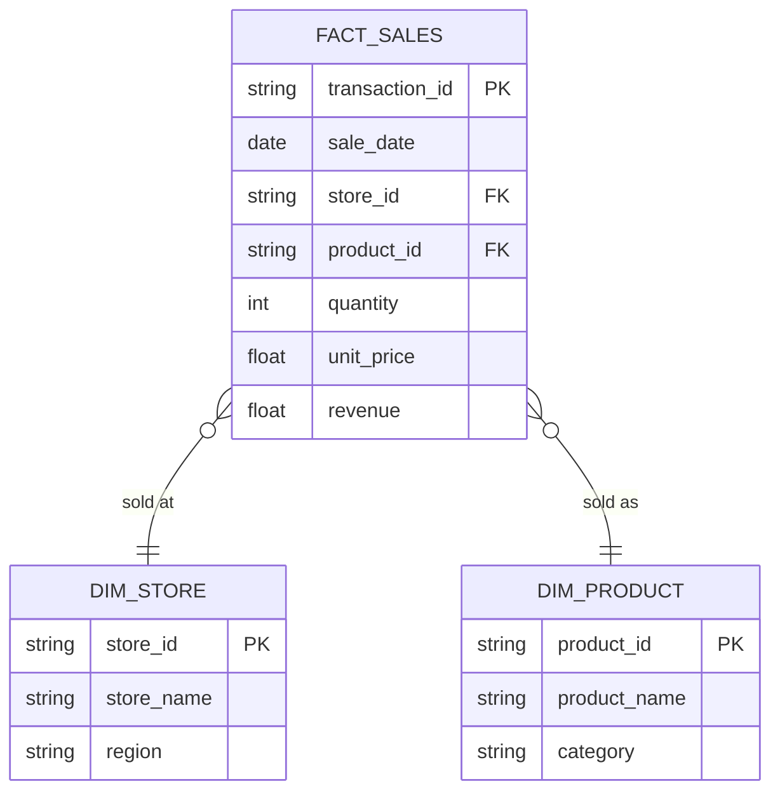
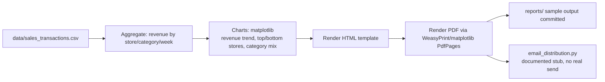

# Design: Automated Report Distribution

## a) Problem / Requirements

**Business question:** Sales leadership at a multi-store retailer wants a recurring
(weekly) snapshot of sales performance — revenue by store/category, week-over-week
trend, and top/bottom performers — without a BI engineer manually pulling numbers
and building charts every week.

**Who this is for:** Regional sales managers and category leads who want a
5-minute-read PDF/HTML digest in their inbox every Monday morning, mirroring the
kind of "dashboard emailed to N recipients" automation used at Bizcuit Solution
and internally at CP Axtra/Makro.

**Scope of this repo:** Generate synthetic transaction-level sales data, aggregate
it into a reporting model, render a PDF + HTML report with charts, and provide a
documented (but *not wired-up*) email-distribution step. No real email is sent by
this repo — `src/email_distribution.py` stubs the send call and documents exactly
how it would be configured with a real SMTP server and recipient list.

## b) Data Flow / Entity Diagram

The reporting data model is a small star schema (fact + two dimensions). The
report-generation pipeline itself is a linear flow on top of that schema:



Pipeline flow (what `src/build_report.py` actually executes):



## c) Data Dictionary

**fact_sales** (grain: one row per store/product/day transaction line)

| Column | Type | Nullable | Description | Example |
|---|---|---|---|---|
| transaction_id | string | No | Unique id for the transaction line | `TXN-000123` |
| sale_date | date | No | Date of sale | `2026-07-15` |
| store_id | string | No | FK to dim_store | `ST-004` |
| product_id | string | No | FK to dim_product | `PR-0231` |
| quantity | int | No | Units sold | `3` |
| unit_price | float | No | Price per unit (THB) | `129.00` |
| revenue | float | No | `quantity * unit_price` | `387.00` |

**dim_store**

| Column | Type | Nullable | Description | Example |
|---|---|---|---|---|
| store_id | string | No | Primary key | `ST-004` |
| store_name | string | No | Human-readable store name | `Makro Rangsit` |
| region | string | No | Region grouping used for report rollups | `Central` |

**dim_product**

| Column | Type | Nullable | Description | Example |
|---|---|---|---|---|
| product_id | string | No | Primary key | `PR-0231` |
| product_name | string | No | Human-readable product name | `Instant Noodles 60g` |
| category | string | No | Category used for the category-mix chart | `Grocery` |

## d) Schema Design

Implemented as `pandas` dtypes in `src/generate_data.py` (rather than a live
database) since the deliverable is a standalone, clone-and-run reporting script —
but the schema is written so it maps 1:1 onto real warehouse tables:

```python
FACT_SALES_SCHEMA = {
    "transaction_id": "string",
    "sale_date": "datetime64[ns]",
    "store_id": "string",
    "product_id": "string",
    "quantity": "int64",
    "unit_price": "float64",
    "revenue": "float64",
}

DIM_STORE_SCHEMA = {
    "store_id": "string",
    "store_name": "string",
    "region": "string",
}

DIM_PRODUCT_SCHEMA = {
    "product_id": "string",
    "product_name": "string",
    "category": "string",
}
```

**Design choices:**

- **Grain = one row per transaction line**, not pre-aggregated, so the report
  layer is responsible for all rollups (this mirrors how a real fact table works
  and lets us demonstrate the aggregation step explicitly rather than hiding it
  in the data generator).
- **Star schema (fact + 2 dims)** rather than one wide denormalized table, so the
  design doc demonstrates normalized dimensional modeling even though the
  physical storage here is CSV. `dim_store.region` and `dim_product.category`
  are the two grouping keys the report actually slices by.
- **String IDs with prefixes** (`ST-`, `PR-`, `TXN-`) instead of raw integers, to
  make the CSVs self-describing when opened directly.
